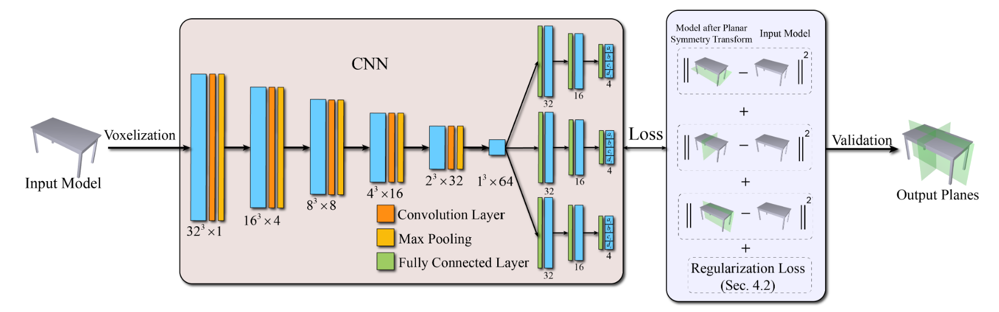
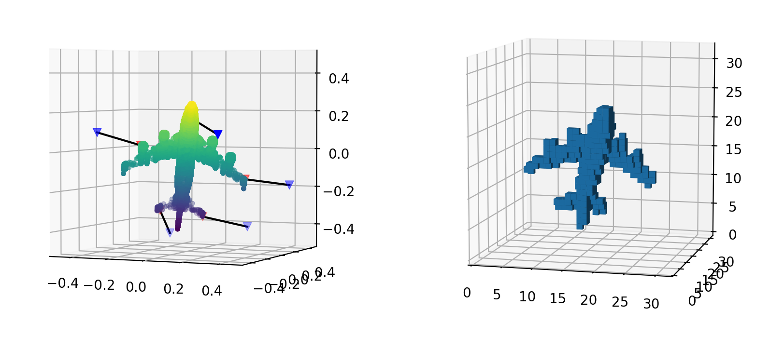
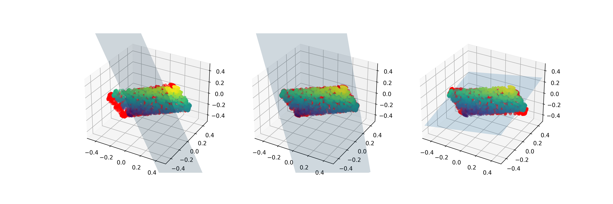
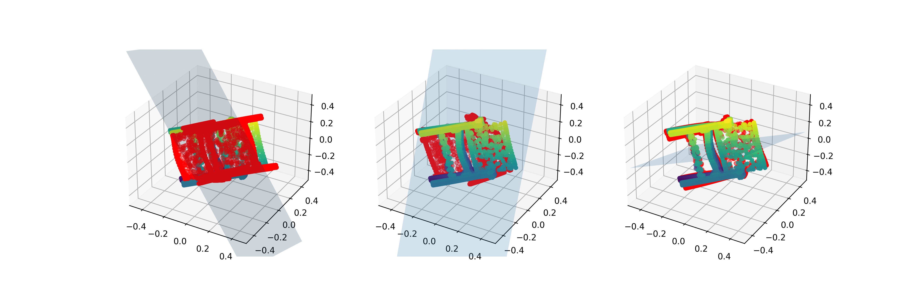
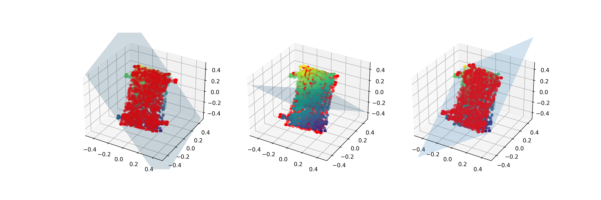

# IMPLEMENT for PRS-NET

Implementation for PRS-Net: Planar Reflective Symmetry Detection Net for 3D Models

### Usage
**NOTICE:** All `parameters` and `file path` should be set on source files. Setting with argument parser is on working.

- filter dataset and set proportion for spliting train and test
  ``` bash
  python utils/filter.py
  ```

- pre-processing original `ShapeNetCore.v2` dataset, including voxelization and compute closest points
  ``` bash
  python utils/pretreat.py
  ```

- train network
  ``` bash
  python train.py
  ```

- test network
  ``` bash
  python test.py
  ```


### Network Architect



### Pretreated DataSet
- compute closest points and run voxelization


### Evaluation
```
So bad, working on it now... [Sad]
```


